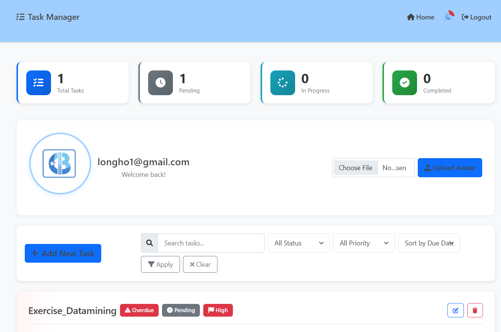
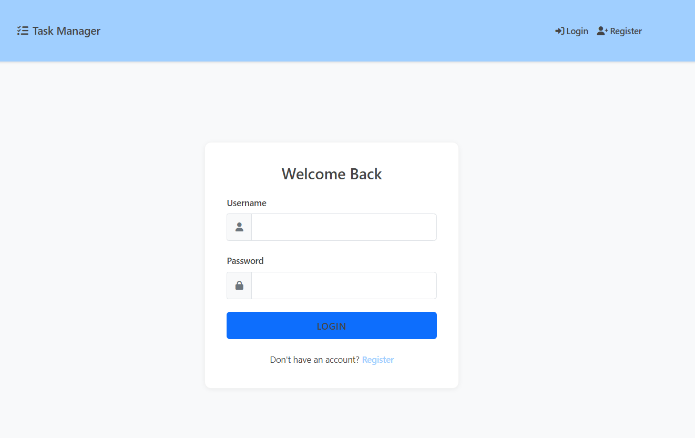
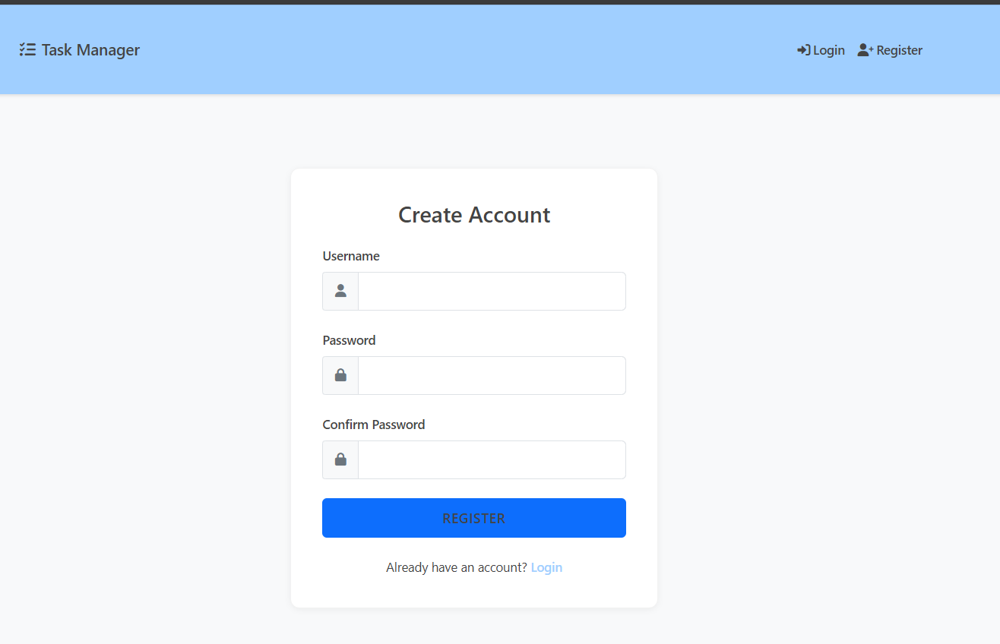
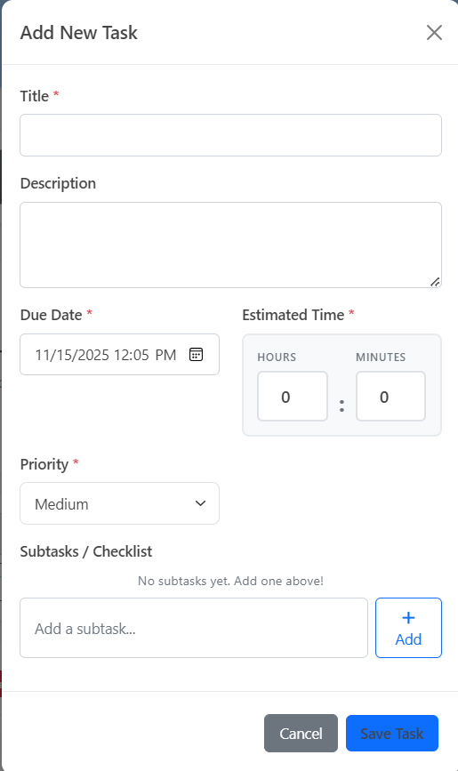
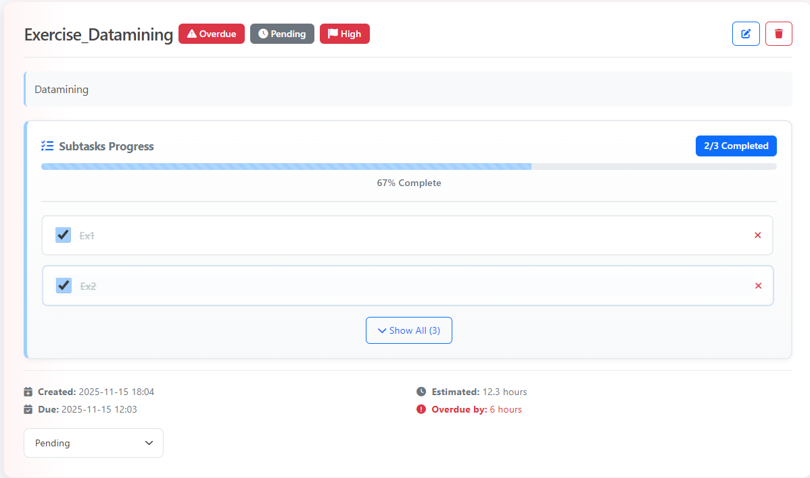
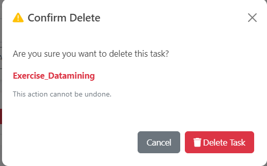

# 📋 Task Manager - Ứng Dụng Quản Lý Công Việc

<div align="center">

**Một ứng dụng quản lý công việc hiện đại, đầy đủ tính năng được xây dựng bằng Flask**

[Giới thiệu](#-giới-thiệu) • [Tính năng](#-tính-năng) • [Cài đặt](#-cài-đặt) • [Sử dụng](#-hướng-dẫn-sử-dụng)

</div>

---

## 🎯 Giới thiệu

**Task Manager** là ứng dụng web quản lý công việc được phát triển bằng Flask, giúp người dùng:

- ✅ Tổ chức và quản lý công việc hiệu quả
- 📊 Theo dõi tiến độ qua dashboard thống kê
- ✅ Quản lý subtasks và checklist chi tiết
- 🔍 Tìm kiếm và lọc tasks nhanh chóng
- 🎨 Giao diện đơn giản, dễ sử dụng

---

## ✨ Tính năng

### 🔐 Xác thực người dùng
- Đăng ký/Đăng nhập với 
- Session management an toàn

### 📊 Dashboard thống kê
- Statistics cards: Total, Pending, In Progress, Completed
- Theo dõi task trễ hạn
- Badge cảnh báo trên avatar

### 📝 Quản lý Task
- **Tạo/Chỉnh sửa/Xóa** task với modal form
- **Thông tin task:** Title, Description, Due Date, Estimated Time, Priority, Status
- **Real-time update** trạng thái không cần reload
- **Auto-complete subtasks** khi đánh dấu Completed

### ✅ Subtasks/Checklist
- Thêm/Xóa/Tick subtasks
- Progress bar hiển thị phần trăm hoàn thành
- Badge "X/Y Completed" cập nhật real-time
- Show All/Less khi có nhiều subtasks

### 🔍 Tìm kiếm và Lọc
- Tìm kiếm theo title và description
- Lọc theo Status và Priority
- Sắp xếp: Due Date, Priority, Created, Title

### 🎨 Giao diện
- Bootstrap 5 + Custom CSS
- Toast notifications
- Responsive design
- Animations và hover effects

---

## 🖼️ Giao diện ứng dụng

### 🏠 Trang chủ - Dashboard

*Dashboard với statistics cards và danh sách tasks*

### 🔐 Trang Đăng nhập

*Form đăng nhập đơn giản và thân thiện*

### 📝 Trang Đăng ký

*Form đăng ký tài khoản mới*

### ➕ Modal Thêm Task

*Modal form thêm task với đầy đủ các trường*

### 📋 Task Card

*Task card hiển thị đầy đủ thông tin và subtasks*

### 🗑️ Modal Xác nhận Xóa

*Modal xác nhận an toàn trước khi xóa*

---

## 🛠️ Công nghệ sử dụng

**Backend:**
- Flask 3.0.2
- Flask-SQLAlchemy 3.1.1
- Flask-Login 0.6.3
- SQLite

**Frontend:**
- Bootstrap 5
- Font Awesome
- JavaScript + AJAX

---

## 📦 Cài đặt

### Yêu cầu
- Python 3.8+
- pip

### Các bước

1. **Clone repository:**
```bash
git clone https://github.com/kz16sep/ptud-gk-de-2.git
cd ptud-gk-de-2
```

2. **Tạo môi trường ảo:**
```bash
# Windows
python -m venv venv
venv\Scripts\activate

# Linux/Mac
python3 -m venv venv
source venv/bin/activate
```

3. **Cài đặt dependencies:**
```bash
pip install -r requirements.txt
```

4. **Chạy ứng dụng:**
```bash
python app.py
```

5. **Truy cập:** http://localhost:5000

> **Lưu ý:** Database sẽ tự động được tạo khi chạy ứng dụng lần đầu.

---

## 📖 Hướng dẫn sử dụng

### 1. Đăng ký & Đăng nhập
- Truy cập http://localhost:5000
- Click "Register" để tạo tài khoản (Username tối thiểu 3 ký tự, Password tối thiểu 6 ký tự)
- Đăng nhập với thông tin đã đăng ký

### 2. Quản lý Task

**Thêm Task mới:**
- Click nút "+ Add New Task"
- Điền thông tin: Title, Description, Due Date, Estimated Time (giờ/phút), Priority, Status
- Thêm subtasks (tùy chọn): Nhập và click "Add" hoặc nhấn Enter
- Click "Save Task"

**Chỉnh sửa Task:**
- Click nút Edit (icon bút chì) trên task card
- Thay đổi thông tin và click "Save Task"

**Xóa Task:**
- Click nút Delete (icon thùng rác) trên task card
- Xác nhận trong modal

**Cập nhật trạng thái:**
- Chọn trạng thái từ dropdown "Status" ở cuối task card
- Cập nhật real-time, không cần reload

### 3. Quản lý Subtasks
- **Tick/Untick:** Click checkbox bên cạnh subtask
- **Thêm:** Nhập trong modal Add/Edit Task
- **Xóa:** Click icon X bên cạnh subtask
- **Show All:** Click "Show All (X)" để hiển thị tất cả subtasks

### 4. Tìm kiếm và Lọc
- Nhập từ khóa vào ô "Search tasks..."
- Chọn Status Filter, Priority Filter, Sort By
- Click "Apply" hoặc "Clear"

### 5. Upload Avatar
- Chọn file ảnh (JPG, PNG, GIF, tối đa 16MB)
- Click "Upload Avatar"
- Ảnh tự động resize về 200x200px

---

## 🗂️ Cấu trúc dự án

```
ptud-gk-de-2/
├── app.py                 # Flask app, models, routes
├── requirements.txt       # Dependencies
├── README.md             # File này
│
├── instance/
│   └── tasks.db          # SQLite database
│
├── static/
│   ├── css/style.css     # Custom CSS
│   ├── js/script.js      # JavaScript
│   └── avatars/          # Avatar người dùng
│
└── templates/
    ├── base.html         # Base template
    ├── index.html        # Dashboard + Task list
    ├── login.html        # Trang đăng nhập
    └── register.html     # Trang đăng ký
```

---

## 🔧 Xử lý lỗi thường gặp

### Lỗi "No module named 'flask'"
```bash
# Đảm bảo đã activate venv và cài đặt dependencies
venv\Scripts\activate  # Windows
pip install -r requirements.txt
```

### Lỗi database
```bash
# Xóa database cũ và chạy lại
del instance\tasks.db  # Windows
rm instance/tasks.db   # Linux/Mac
python app.py
```

### Lỗi port 5000 đã được sử dụng
Đổi port trong `app.py`:
```python
if __name__ == '__main__':
    app.run(port=5001, debug=True)
```

### Subtasks không hiển thị
- Refresh trang: Ctrl+F5
- Kiểm tra console browser (F12)
- Database sẽ tự động được tạo lại khi chạy `python app.py`

---

## 📝 Ghi chú kỹ thuật

**Database Schema:**
- **User:** id, username, password_hash, role, avatar_path
- **Task:** id, title, description, status, created_at, due_date, finished_at, estimated_hours, priority, user_id
- **Subtask:** id, title, completed, task_id, created_at

**Security:**
- Password hashing với Werkzeug
- Session management với Flask-Login
- SQL injection protection với SQLAlchemy ORM
- File upload validation

---

## 👨‍💻 Tác giả

**Huỳnh Long Hồ**  
🎓 Mã số sinh viên: 21008411  
📚 Môn học: Phát triển ứng dụng

---

<div align="center">


</div>
